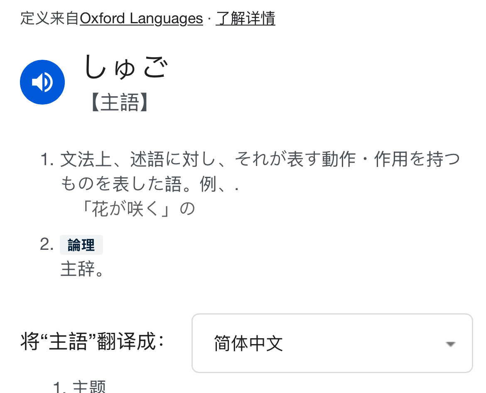

这篇是把「日语句式」原始笔记整理成可复习版本，重点不追求术语堆叠，而是先把最关键的框架抓牢：

- 日语句子里，**述语在句末**是最稳定的规则
- 主语、宾语、补语、状语在述语前相对灵活
- 连体修饰、连用修饰通常都在被修饰对象前

---

## 一、先记住“句末述语”这个总原则

日语句子可以出现多种成分组合（主谓、主宾谓、主补谓、主状谓等），但最核心规律是：

> **句子最终要由述语收束在末尾。**

所以与其背很多“固定语序模板”，不如先确认最后的述语是什么，再看前面成分怎么组织。

---

## 二、述语的三种主类型

日语里可作述语的核心类型可先按学习阶段简化为三类：

1. **动词述语**：描述动作/变化（例：行く、食べる）
2. **形容词述语**：描述性质（例：高い）
3. **名词述语**：描述身份/属性（例：学生だ）

其中名词述语常由名词 + だ／です／である构成。学习上可把它和な形容词述语区分开：

- 名词本身不活用，后接助动词构成述语
- な形容词有自身的活用体系

---

## 三、基础语序：主（宾）述，但中间成分可调整

常见教学会写成 SOV（主-宾-述），这个方向是对的，但要加一句：

- **真正“刚性”的是述语句末**
- 主语/宾语/补语/状语在述语前有一定调序空间

比如为了强调、对比、信息焦点，主宾位置会变化，但只要不破坏述语句末，句子通常仍可成立。

你可以把自然表达理解成：

- 先决定“这句最后要说什么”（述语）
- 再把“谁、对谁、在何时何地、以何方式”等信息往前摆

---

## 四、补语和状语：重点是“在述语前”

从可理解性角度看，补语和状语一般放在述语前即可，内部排序可按信息组织需求调整。

实操上可以优先使用一个稳定策略：

- 时间 → 场所 → 对象 → 方式 → 动作

这不是唯一正确顺序，但作为学习期模板很实用，尤其适合写作时减少语序焦虑。

---

## 五、从句语序与普通句基本一致

从属节（从句）内部并不会突然换一套语序系统，本质上仍遵循“述语在后”的组织方式。

你看到“顺序复杂”的原因，往往是：

- 某些成分被提出作为修饰对象
- 句子被切成了“修饰块 + 被修饰名词”的结构

所以处理复杂句时，不妨先把从句单独还原为一个完整小句，再看它如何修饰后面的名词。

---

## 六、修饰规则：连体/连用都在前

这条在阅读里非常关键：

- **连体修饰**：放在被修饰名词前
- **连用修饰**：放在被修饰述语（动词/形容词等）前

也就是说，日语是典型的“前置修饰”语言。读长句时从后往前回收结构，通常会更快看清主干。

---

## 七、复习用一页总结

- 句末必须落在述语上
- 述语可先分为：动词/形容词/名词述语
- 基础语序是主（宾）述，但述语前成分有弹性
- 从句内部语序与普通句一致
- 连体、连用修饰都前置

把这五条吃透，句式分析会顺很多。

---

## 参考与原始资料

- [述语概念整理](https://xn--3kq3hlnz13dlw7bzic.jp/predicate/)
- [文の成分の位置について学ぼう](https://www.kokugobunpou.com/%E6%96%87%E3%81%AE%E7%B5%84%E3%81%BF%E7%AB%8B%E3%81%A6/%E6%96%87%E3%81%AE%E6%88%90%E5%88%86%E3%81%AE%E4%BD%8D%E7%BD%AE/#gsc.tab=0)
- [文節どうしの関係をマスターしよう](https://www.kokugobunpou.com/%E6%96%87%E3%81%AE%E7%B5%84%E3%81%BF%E7%AB%8B%E3%81%A6/%E6%96%87%E7%AF%80%E3%81%A9%E3%81%86%E3%81%97%E3%81%AE%E9%96%A2%E4%BF%82/#gsc.tab=0)
- [修飾語とは](https://wordrabbit.jp/grammar/modifier)
- [語順に気を配れば、理解されやすい日本語文章になる](https://writers-way.com/article/1979)
- [日本語の語順と読点について](https://dewdrop-mitch.sakura.ne.jp/essay-j-6.html)
- [日本語文の特性 - 語順の自由さ](https://yinamoto.hatenablog.com/entry/2019/01/26/134045)
- [補説§６](https://niwasaburoo.amebaownd.com/posts/5731369/)
- [名詞述語文、形容詞述語文、動詞述語文とは？](https://nihongokyoiku-shiken.com/noun-predicate-sentences-adjective-predicate-sentences-and-verb-predicate/)
- [日本語教育能力検定試験：文構造](https://tak-japan.com/bunkouzou/)

补充原始资料（PDF）：
[句式笔记 PDF](../../assets/japanese-notes/sentence-structure/18247DA9-A888-4084-95FB-066DC8BE2D08.pdf)
